

  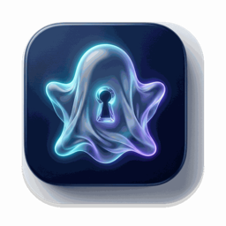

<h1 align="center">Phantom</h1>

  <strong>Native macOS In-Place File Concealment & Independent Credential Protection</strong>

  
  
  
  
  

  <a href="#overview">Overview</a> •
  <a href="#core-advantages">Advantages</a> •
  <a href="#feature-tour">Features</a> •
  <a href="#system-requirements">Requirements</a> •
  <a href="#quick-start">Quick Start</a> •
  <a href="README_ZH.md">简体中文</a>

---

## Overview

In collaborative workspaces, presentations, or shared-Mac environments, personal documents, private photos, and sensitive project assets can easily be exposed via Finder searches, recent files, Spotlight, or AirDrop. Traditional container images take significant time and risk data corruption on large files, while relying on the system unlock password offers zero real privacy isolation.

**Phantom** is purpose-built for macOS: it conceals items instantaneously in-place using native filesystem attributes without data duplication, while establishing a dedicated master credential independent of the macOS login password to protect your digital boundaries.

---

## Core Advantages

- **Instant In-Place Concealment**: Operates directly at original storage paths with zero data copying or re-encoding, eliminating storage overhead and write-interruption risks.
- **Independent Credentials & Touch ID**: Dedicated master password paired with Touch ID, fully decoupled from the macOS login password to safeguard privacy on shared hardware.
- **Proactive Leak Prevention & Status Bar Alerts**: Dynamic visual sentinel displays an amber badge during active use, and triggers an eye-catching **red alert** if the management window is closed while items remain unlocked and exposed in Finder.
- **100% Local Offline Security**: Zero network permissions, zero telemetry, and zero cloud uploads. Credentials reside safely inside the hardware-backed macOS Keychain.
- **Native Lightweight Footprint**: Engineered purely with AppKit and SwiftUI. The application package is approximately 455KB, combining a persistent menu bar panel with a dual-column management center.

---

## Feature Tour

### 1. Independent Credentials & Biometric Unlock
Enforces a master password separate from system login, integrated with Touch ID for single-touch unlock and progressive brute-force rate limiting.

| Figure 1: Master Password Setup | Figure 2: Lock Screen & Touch ID |
| :---: | :---: |
| 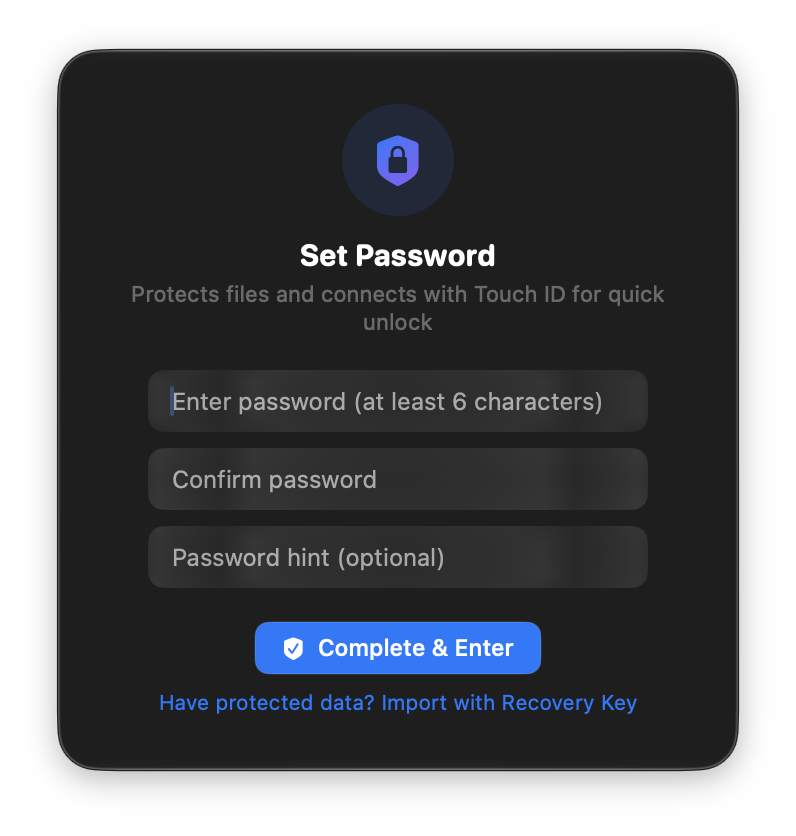 | 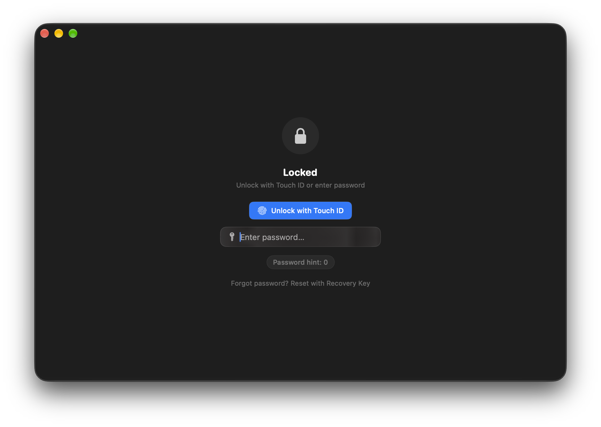 |

---

### 2. Operational Notice & Security Guidelines
Presents essential operational rules before first use: clarifies local-only behavior and recommends avoiding targeting active sync drives or download paths directly into locked directories.

  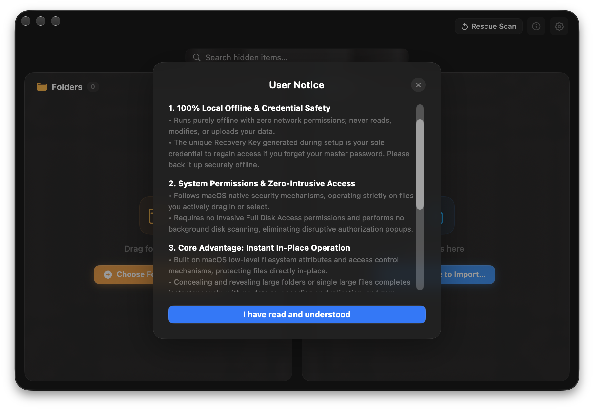

---

### 3. Structured Dual-Column Management Center
Translucent Liquid Glass interface partitioning folders and files into equal columns; features instant search filtering and direct Finder drag-and-drop ingestion.

| Figure 4: Empty Initial State | Figure 5: Populated Asset Index |
| :---: | :---: |
| 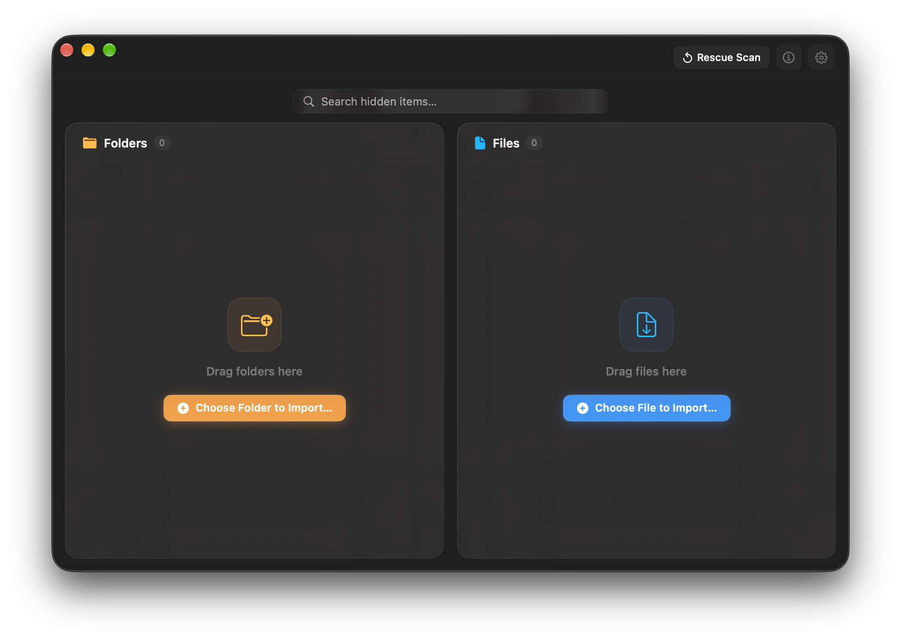 | 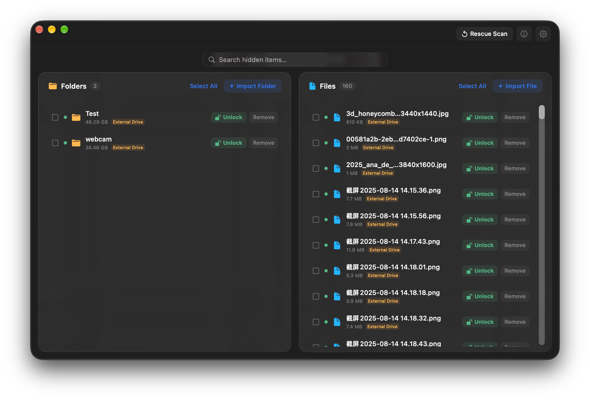 |

---

### 4. Adaptive Batch Operations & Row Controls
The top toolbar dynamically switches between batch actions based on selection state. Rows provide direct unlock toggles, Finder reveals, and confirmation modals against accidental removal.

| Figure 6: Adaptive Batch Toolbar | Figure 7: Row Actions & Finder Reveal |
| :---: | :---: |
| 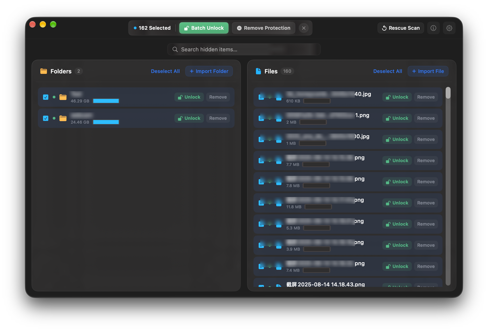 | 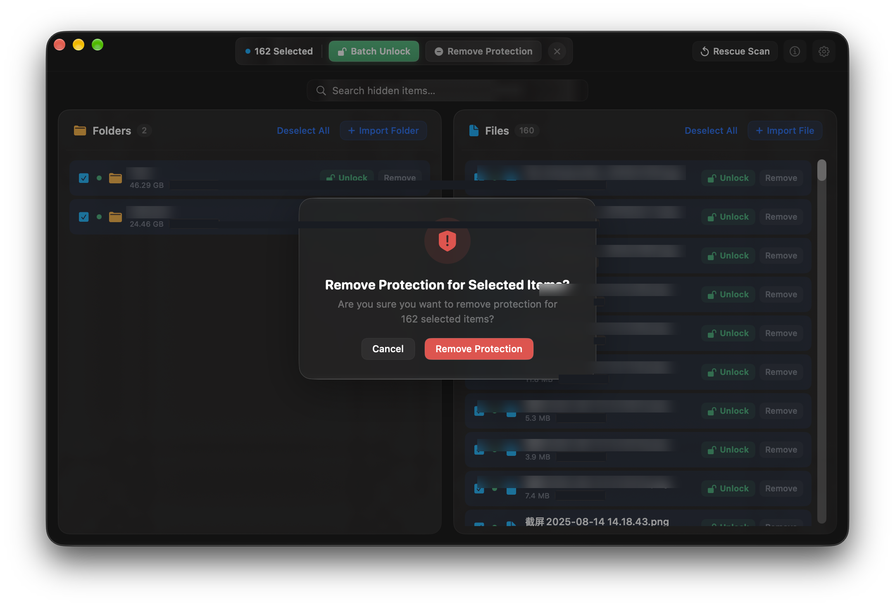 |

---

### 5. Menu Bar Floating Panel & Active Leak Prevention
Resides in the macOS menu bar with an intelligent visual sentinel: displays an amber indicator during active editing and transitions to an eye-catching **red alert** if the management window is closed while items remain unlocked and exposed in Finder. Clicking the status item opens a sleek floating panel to inspect recent assets or lock everything with one touch, without interrupting active work.

  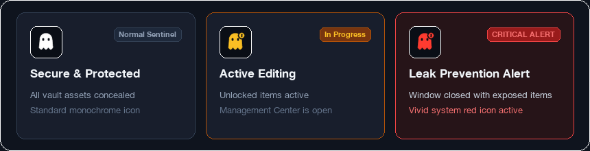

  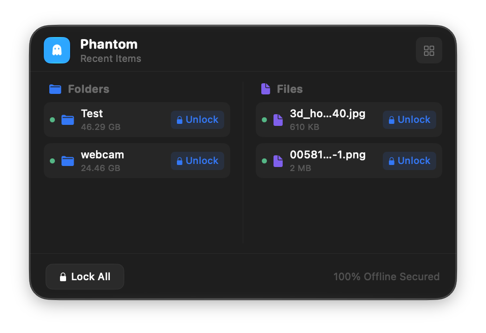

---

### 6. Preferences & Dedicated Recovery Key
Supports instant bilingual switching and password updates. The high-entropy Recovery Key generated at setup serves as the sole credential to regain access offline.

  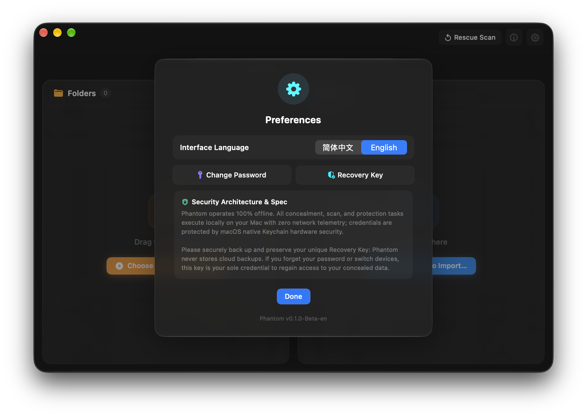

---

## System Requirements

- **Operating System**: macOS 14.0 (Sonoma) or later
- **Architecture**: Apple Silicon (M1 / M2 / M3 / M4 series chips)
- **Recommended Hardware**: Mac models or Magic Keyboards equipped with Touch ID

---

## Quick Start

1. Download `Phantom-v0.1.0-Beta-en.dmg` (or Chinese `-v0.1.0-Beta.dmg`) from Releases;
2. Mount the disk image and drag **Phantom** into your `Applications` folder;
3. Launch the app, configure your master password, and securely archive your Recovery Key;
4. Click the menu bar icon or drag files into the management window to begin protection.

---

## Licensing & Copyright

- **Copyright © 2026 Phantom Team. All rights reserved.**
- Commercial proprietary software protected by intellectual property laws. Unauthorized reverse engineering, modification, or redistribution is strictly prohibited.
