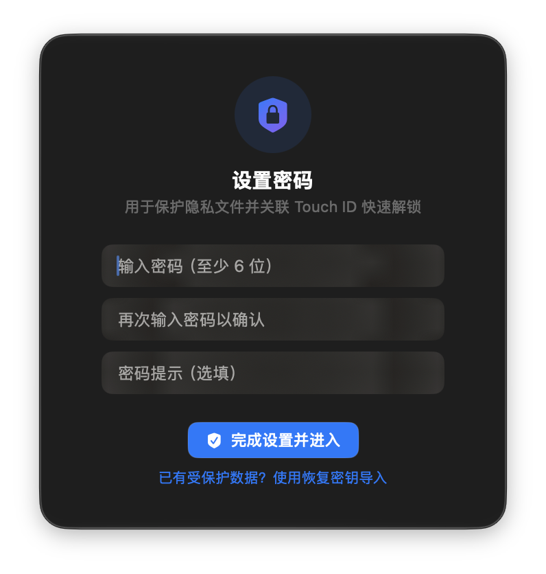
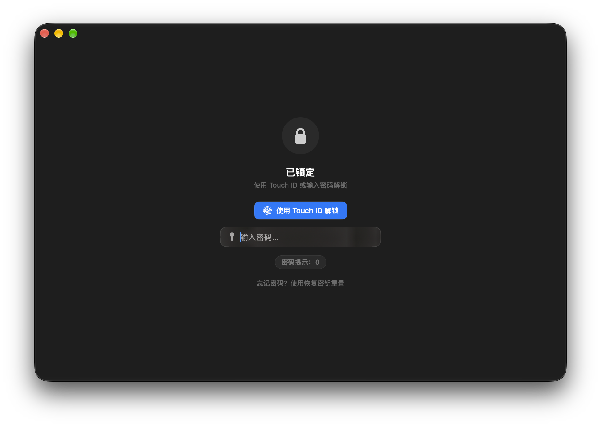
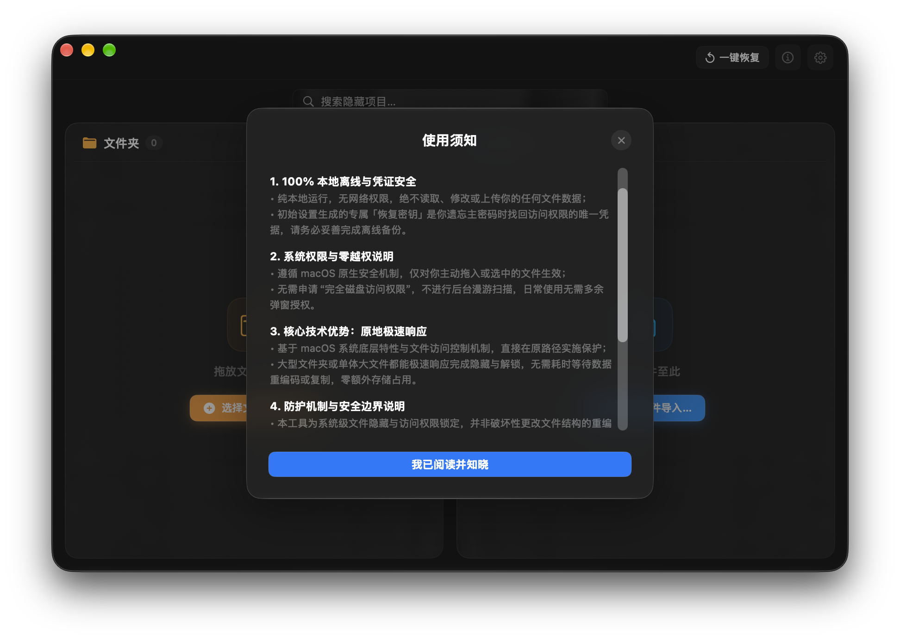
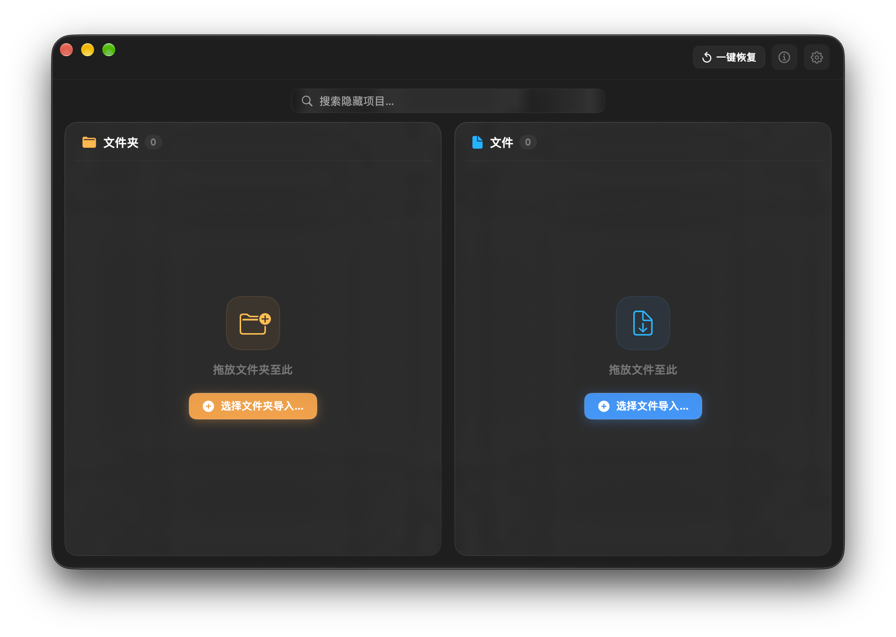
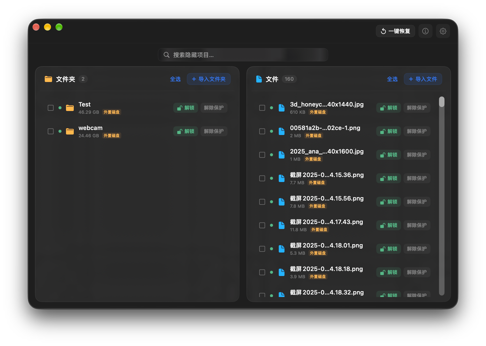
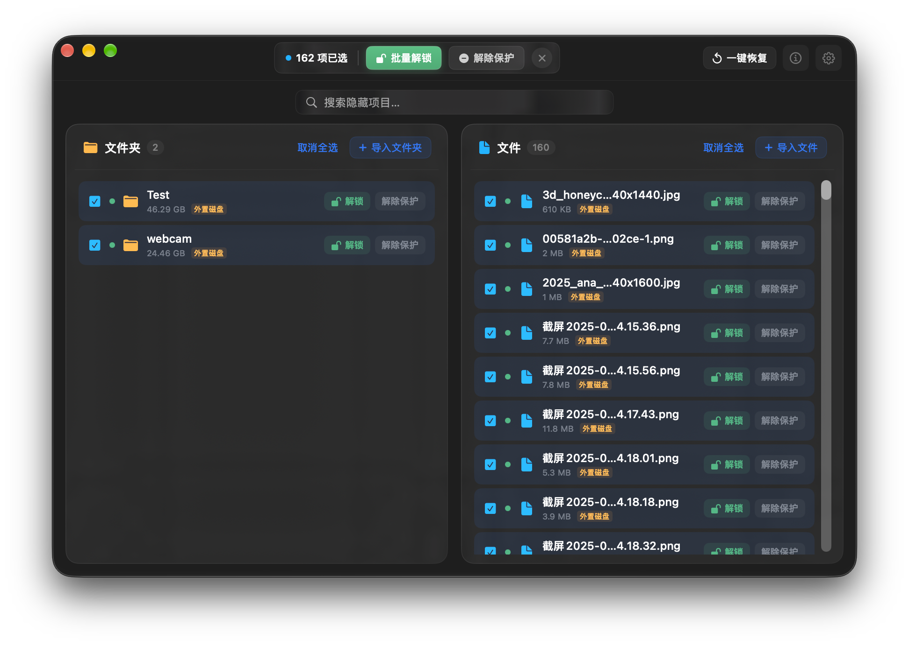
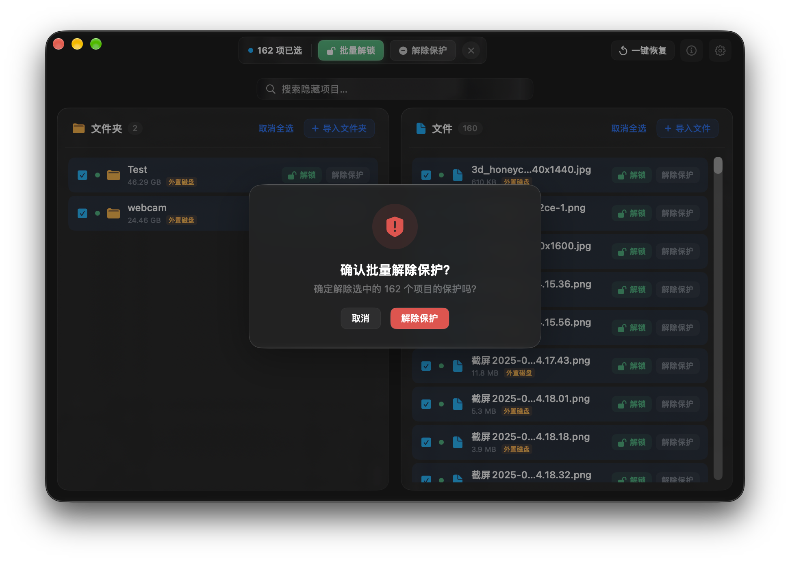
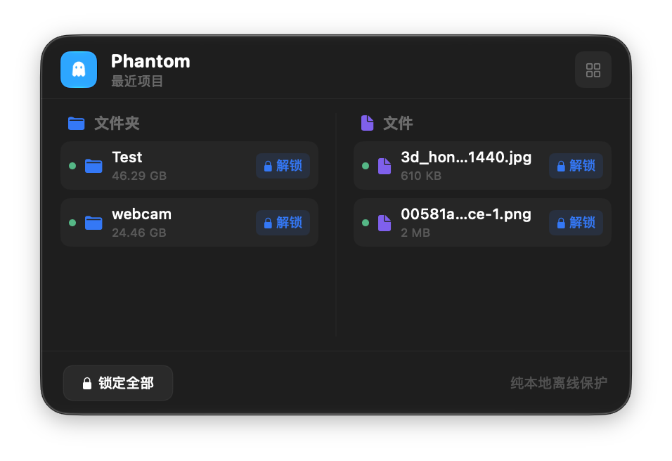
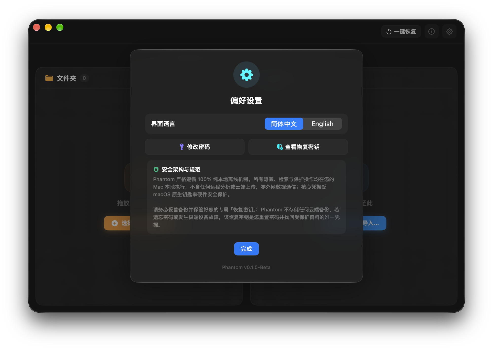

# Phantom

[English](README_EN.md) | [简体中文](README.md)

Phantom 是一款专为 macOS 设计的原生隐私保护与文件隐藏管理工具。基于 macOS 系统原生文件控制与属性管理机制，为个人私密文件与敏感工作数据提供轻量、快速、无损的隐藏保护。

---

## 软件介绍与开发初衷

在日常办公、外接演示、屏幕共享或多成员共用 Mac 的场景中，个人文件、私人相册、财务凭证或重要项目资料极易在访达（Finder）检索、最近使用列表、聚光灯搜索（Spotlight）以及隔空投送时不经意暴露。

传统解决方案往往存在显著痛点：
- **容器重打包机制繁琐耗时**：依靠压缩包或加密磁盘镜像，每次访问都需要经历漫长的数据复制与重写，针对大型文件动辄等待数十分钟，且伴随非正常断电导致数据损坏的隐患；
- **系统登录密码缺乏隔离**：部分工具直接依赖 macOS 登录密码作为鉴权凭据，一旦家庭成员、借用设备的同事或维修人员知晓系统锁屏密码，隐私保护便形同虚设；
- **越权与网络风险**：许多第三方管理软件申请过高的系统磁盘常驻扫描权限，并附带后台遥测与网络上传模块，增加了敏感数据外泄的潜在面。

**Phantom 的开发初衷**：为 Mac 用户打造一款无缝融入系统体验的隐私保护工具——不改变文件原始结构、不进行耗时的数据搬迁重写、具备独立于系统密码的安全凭据体系，以原生轻量的形式守护个人数字边界。

---

## 核心优势

- **原路径极速响应**：基于 macOS 文件访问控制与系统属性机制直接在原路径实施隐藏保护。无论是常规文档还是各类大型文件，均可快速完成隐藏与解锁，零额外存储占用，杜绝因中断复制导致的数据损坏。
- **独立密码与生物识别隔离**：建立与 macOS 系统登录密码隔离的专属主密码体系，即便他人知晓电脑的开机锁屏密码，也无法打开 Phantom 保护区。同时深度整合 Touch ID 触控 ID，提供轻触即开的便捷操作。
- **纯本地离线架构**：应用不包含任何网络请求与通信代码，零后台遥测、零云端上传。核心凭据依托 macOS 系统钥匙串硬件级加密存储，切实保障数据自主可控。
- **双层极简管理体系**：提供常驻状态栏的轻量 Liquid Glass 悬浮面板与结构严整的双栏管理中心大窗口，既满足高频单项快捷调取，又兼顾批量数据整理。
- **极小资源占用**：采用纯原生 AppKit 与 SwiftUI 构建，杜绝冗余第三方框架，完整安装包体严格控制在 500KB 左右，内存开销极低。

---

## 功能详解与界面导览

### 1. 独立账户体系与生物识别验证

为防止设备借出或多人共用电脑时系统密码泄露带来的连带风险，Phantom 强制建立独立的鉴权账户。

| 图 1：初次密码与账户建立 | 图 2：锁屏验证与 Touch ID 唤起 |
| :---: | :---: |
|  |  |

- **专属主密码**：初次启动时需设定至少 6 位的独立主密码，并可配置防遗忘密码提示；
- **Touch ID 快速通行**：在支持触控 ID 的 Mac 设备上，验证面板深度集成指纹唤起，日常使用无需反复键盘键入密码；
- **防暴力猜测保护**：连续多次输错密码将触发保护性倒计时，逐步递增锁定时长，有效抵御近场恶意尝试。

---

### 2. 使用须知与规范说明

数据安全始终建立在明确的认知之上。首次进入主界面前，系统将呈现规范的使用须知。

- **离线与零越权声明**：阐明纯本地运行与无网络权限原则，明确告知软件无需入侵式磁盘漫游扫描权限；
- **原地操作机制**：说明直接基于原路径属性生效的响应原理与安全边界；
- **协作规范指引**：提醒用户避免将实时同步盘（如 iCloud、OneDrive）或下载器的目标路径直接指向已锁定目录，并建议在卸载软件前先解除全部项目的隐藏状态。

---

### 3. 直观严谨的双栏管理中心

管理中心采用经典通透的 Liquid Glass 材质，以结构化双栏清晰归集全部受保护项目。

| 图 4：管理中心空白初始态 | 图 5：管理中心数据归集列表态 |
| :---: | :---: |
|  |  |

- **文件夹与文件平分双栏**：左侧专职聚合“文件夹”，右侧细致呈现“文件”，条目容量、状态与路径类型一目了然；
- **即时模糊搜索**：顶部中央常驻搜索框，键入字符即可在双栏中差量过滤目标项目；
- **便捷拖拽纳管**：支持将文件或文件夹直接从访达拖入窗口，即刻纳管并隐藏。

---

### 4. 自适应批量管理与精细化单项操作

无论是日常针对单项文件的即时解锁，还是对成批数据的高效归整，Phantom 均提供符合直觉的操作支持。

| 图 6：批量选中自适应管理条 | 图 7：单项操作与访达直达 |
| :---: | :---: |
|  |  |

- **自适应批量操作条**：支持一键全选或灵活多选。顶栏控制条根据当前选中项目的实际状态自动展示操作按钮：全锁时显示「批量解锁」、全开时显示「批量锁定」、混合态显示带计数的细分操作；
- **单项悬浮快捷键**：条目右侧提供独立解锁/锁定按钮，并在解锁状态下提供「访达」图标，点击直接打开目标所在目录并高亮定位；
- **二次确认防误触**：执行解除保护操作时，系统弹出标准确认卡片，杜绝因误点击造成项目脱离纳管。

---

### 5. 常驻状态栏小窗口快速管理

在日常轻量办公场景中，无需频繁打开庞大的管理主窗口。

- **常驻菜单栏**：顶部菜单栏展示幽灵锁孔图标，橙色高亮提示当前存在未锁定的隐私条目；
- **最近项目调取**：悬浮面板自动陈列最近访问的受保护文件夹与文件，支持直接在微面板内就地解锁或直达访达；
- **失焦防窥销毁**：点击面板外部任意屏幕区域，面板立即收起并销毁当前交互态，防止旁人侧目窥视。

---

### 6. 偏好设置与专属恢复密钥保护

Phantom 将数据掌控权与恢复主动权完全交付给用户。

- **界面语言切换**：支持简体中文与 English 界面即时平滑切换；
- **修改密码与密码提示**：支持随时通过当前主密码重设安全凭据；
- **专属恢复密钥**：初次配置时系统会自动生成一串高强度专属「恢复密钥」。因 Phantom 无任何云端中继或账号找回机制，若遗忘主密码，该恢复密钥是重设密码与找回保护资产的唯一凭据，用户需妥善离线保存。

---

## 系统环境与硬件要求

- **操作系统**：macOS 14.0 (Sonoma) 或更高版本（全面兼容 macOS 15 Sequoia 及以上版本）
- **架构平台**：Apple Silicon 架构（兼容 M1 / M2 / M3 / M4 系列全部芯片）
- **外设推荐**：具备 Touch ID 触控 ID 识别支持的 Mac 设备或妙控键盘

---

## 安装与快速上手

1. 前往 Release 发布页下载最新版本的 `Phantom-v0.1.0-Beta.dmg`；
2. 双击打开安装镜像，将 **Phantom** 拖入 `Applications` 应用程序文件夹；
3. 打开 Phantom，遵循引导设置独立主密码并记下专属恢复密钥；
4. 点击顶部状态栏的幽灵图标，或将需要保护的文件直接拖入管理中心，即刻开启隐私守护。

---

## 知识产权与规范声明

- **版权所有 © 2026 Phantom Team. 保留所有权利。**
- 本软件受相关知识产权法与反不正当竞争法保护。
- 未经正式授权，任何组织或个人不得对本软件的任何部分进行非法逆向工程、篡改或重新打包分发。
